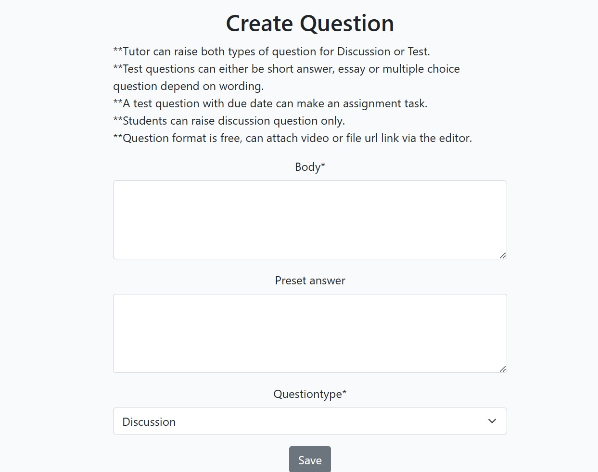
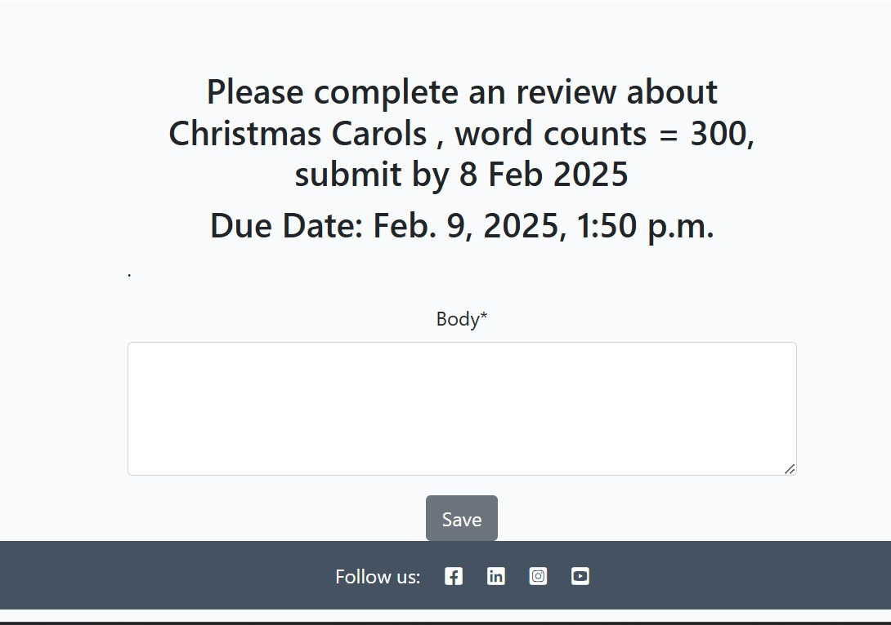
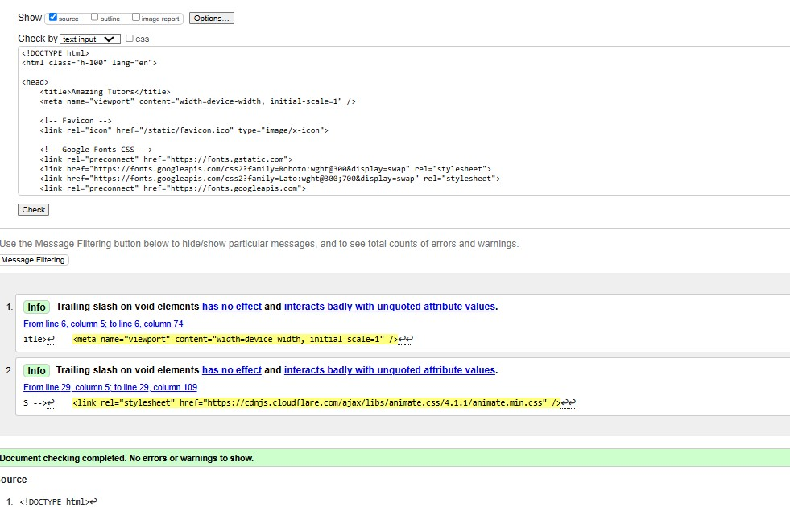
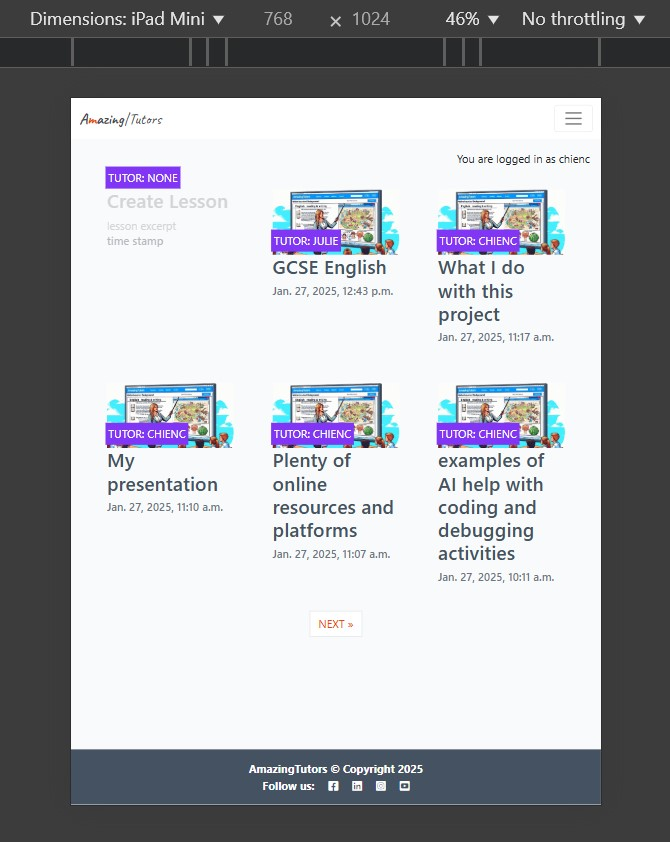

# Amazing Tutors

Amazing Tutors is a digital-powered learning platform that benefits both tutors and students by providing a flexible, engaging, resourceful, personalized, and responsive web space as a collaborative learning environment, uplifting the learner's motivation and learning experiences.

Growing from the Blog App as its foundation, Amazing Tutors implements several features to accommodate its user groups and enhance their learning experiences with this e-learning platform. A tutor, he/she can list a series of lesson materials in the use of a WYSIWYG editor (summernote) which can attach video or file links easily to create vivid and resourceful lessons for study. The implementation of a Question/Answer board namely class activities is the major plus which offers great flexibility for tutors and students to interact. Tutors can use it to list/edit tests to produce assignments,  quizzes or discussions while students can also submit discussion questions. Students can get grades and feedback quickly from tutors too, all these features form a simple yet robust collaborative learning environment.

Here's my deployed site :
[Amazing Tutors](https://amazingtutors-3f0b6cb3b188.herokuapp.com/)

## UX 

For this e-learning platform, the tutor and students are looking for a simple, neat and intuitive layout. The Tutor can claim the lesson's ownership by creating one from the front page, and he/she can edit it anytime by the WYSIWYG editor via the 'Edit Lesson' button found in the hero image area when the lesson page is loaded.  On the lesson page, all the details of the lesson are presented in front of the tutor and students, following an 'Add Note' button for them to create or update their notes. Then 'Raise Question' button is also presented next to the 'Edit lesson' for the tutor, or only 'Raise Question' is available for the student.   

The Class Activity area following the lesson and note is where collaborations and interaction activities happen. The tutor can raise three types of questions: Type 1 is the question for a test with a due date, namely an assignment question; type2 is the question for a test without a due date namely a quiz; then type 3 is the question for discussion only, and student can raise the same type 3 discussion question. Among those questions and answers, they are all colour-coded separately based on the question or answer owner's role, and the reference of each colour is presented on the tin on the page and easily distinguishable.   

 
 ### Color Scheme

### Typography

- Caveat font was used for the site lego. The font was imported from google fonts. Serif sans is the fall back font in the case of an import error

[Google Fonts](https://fonts.google.com/?query=caveat)

- The icons  used where imported from Font Awesome 

[Font Awesome](https://fontawesome.com/icons)

- The favicon used is from the following link

[Favicon.io](https://favicon.io/favicon-generator/)

### User Stories 

### Site Users

- As a user I can register an account so that I can perform authenticated activities 
- As a user I can login to my account  so that I can see lessons 
- As a user I can logout of my account  so that I keep my account secure
- As a user I can create an lesson and post videos, file links or rich format text so that I can teach students 
- As a user I can browse lessons so that I can choose which lesson to teach or learn
- As a user I can edit and or delete my lessons so that I can manage my own content on the site
- As a user I can edit and or update my notes so that I can manage my own content on the site
- As a user I can edit and or delete my questions so that I can manage my own content on the site 
- As a user I can edit and or delete my Answers so that I can manage my own content on the site
- As a user I can edit and or update the grade and feedback for the students' assignment or quiz submission 
  so that they can get the feedback  

### Site Admin
- As site admin I can access all the lessons, questions, answers, gradefeedback, about,  so that I can manage the site effectively
 

## Wireframes

To follow best practice, wireframes were developed for mobile, tablet, and desktop sizes.
I've used Balsamiq to design my site wireframes

[Balsamiq](https://balsamiq.com/wireframes) 
  

### Devices Wireframes

Click here to see the Devices Wireframes

 
 
     -   
 
     -
 

## Features

### Existing Features

- **Navigation Bar**

- The navigation bar is available on index and lesson_detail pages. It is fully responsive and provides links to all the areas of the website, lesson links are only presented based on whether the user is authenticated and logged in or not. Users are able to navigate on any size device with a burger menu with dropdown for small devices. users can easily click on the site logo to returnm back to the landing page.

  Desktop

  

  Mobile

  

- **Landing Page**
- The user can choose to create a lesson, or browse lessons (5 lessons max per page)

- **The Footer**

- The copyright declamation and links to facebook, linkedin, instagram and youtube

  

- **Lesson details**

- from this simplied example 1-1, we can see the lesson author chienc currently signed in, he has put some content in lesson and his note sections.  
  

Example-1-2 Then move down to class activities section, as chienc the lesson author has submitted a test question with a due date, platform will automatically identify and label its a 'assignemnt' and display the matching background color:cyclamen to make aware by other students. He answered a question from another user jeffchen. The lesson author can see everyone's answer to provide gradefeedback. Here jeffchen and julie have submitted their answers and chienc have graded and left both feedbacks.
  

- chienc also submitted an discussion question, answers of such type question will always be instantly shared and available to all students, chienc can edit his own question as he is the owner, also chienc's question and answer color is distinquished from the students' color and his answer will always be promoted to the top spot because of his role as the lesson author.
     
- Below chienc's discussion question, student jeffchen raised another question, the color is light blue compared to chienc's ocean blue color.
  

- Here in the same lesson, we switch over to the student jeffchen's scope from the tutor chienc's. jeffchen can only raise question as he is not the lesson author aka the tutor.  

- An interesting example picture, here jeffchen has answered both chienc's test assignment questions, one has been submitted but not graded, one has been graded. now jeffchen can edit the answer has not been graded yet. the other answer has been graded so he can no longer edit that answer. 

- In this picture, jeffchen has answered the discussion question from the tutor and he received a grade and feedback. jeffchen also raised a discussion question and he is the question owner so he can edit both the question and answer if its provided by himself. The other student will read or write a answer to the question only but can't edit them. 
  

- **Signup**

- Signup page allows the users to register and join the AmazingTutors site. 
- This allows the user to be able to create his/her lessons or become a student only. 
- User's get a message pop up letting them know they are signedup. 

  

 

- **LogIn** 

- This page allows already authenticated users to log into the site and access lessons.  
- Users get message to let then know they are login
- The logIn will then change to logout once the user is successfully loggedin.
- The user gets a prompt message if they are sure they want to log out , before getting a message they have successfully logged out if they complete the process.
- user won't be allowed to perform any activity if not login 

  

  

  

  
- **Create, Edit and Delete Lesson**

- This page is a form to create a lesson, it is only accessible to authenticated logged in users. 
- Here the user's can edit lesson in rich format text by summernote editor and publish for visibility to all users or keep it as a draft showing as faded from the index and not visible to others  
- Once saved, the user get a message to show the lesson has been created successfully 

  
  

- **Create Note**

- This page is a modal form to create a note which is situated below the lesson body, it is only accessible to authenticated logged in users. 
- Here the user's can edit note in rich format text by summernote editor, the note is only visible by individual and only can update after creation.   
- Once saved, the user will see it displayed immediately. 

  

- **Create, Edit and Delete Question**

- This page is a form to create a question, and once question is created, the user can edit or delete it.  
- Questions and answer are edited via textarea form to avoid unwanted html tag display issues.   
- Once saved, the user will see question on the acreen immediately and a message for update successfully. 

   
     

- **Create, Edit and Delete answer**

- This page is a form to create a answer, and once answer is created, the user can edit or delete it.  
- Questions and answer are edited via textarea form to avoid unwanted html tag display issues.   
- Once saved, the user will see answer on the acreen immediately and a message for update successfully. 
- in ansser create form, question and due date will display 

   
 
  **Create, Update grade_feedback**

- This page is a form to create a grade_feedback, and once grade_feedback is created, the user can update it.    
- The grade and feedback will be displayed with the answer on the acreen immediately and a message for update successfully. 
- once answer is graded, the answer owner won't be able to edit answer again. 

   

### Future Features

- **User Profiles**

- Users to have custom user profiles where they can list there accomplishments in completed lessons with their grades
- Users will have CRUD functionality and autonomy on their profiles
- Users to be able to add profile images for a more personal feel.

- **courses schedule board**

- Tutors and students have schedule board to follow the course timetable 
- also task board can highlight assignments' due date, events or class activities. 

- **AI agent assistant or tutor**

- deploy AI agent that trained up to share the tutor's loading on testing students or give students personalized feedbacks to improve learning experiences. 
- gamified challenges to motivate the students 

## Tools and Technologies used 

-  used for version control. (`git add`, `git commit`, `git push`)
-  used for secure online code storage.
-  used as a cloud-based IDE for development.
-  used for the main site content.
-  used for the main site design and layout.
-  used as the back-end programming language.
-  used for hosting the deployed back-end site.
-  used as the front-end CSS framework for modern responsiveness and pre-built components.
-  used as the Python framework for the site.
-  used as the relational database management.
-  used as the Postgres database from Code Institute.
-  used for online static file storage.
-  used for serving static files with Heroku.
-  used for creating wireframes.
-  used for the icons.
-  currently power codepilot by chatgpt4o version, used to help debug, troubleshoot, and explain things in VScode.

## Database Design 

Here is my Entity Relationship Diagrams (ERD) help to visualize database architecture before creating models.

Site used for ERD

- [Smartdraw.com](https://app.smartdraw.com/editor.aspx?credID=-72573565&depoId=63080189&flags=128)

  

## Agile Development Process

### GitHub Projects

[GitHub Projects](https://github.com/users/jeffchen1118/projects/8) 

- GitHub Projects is the Agile tool used for this project.

 

### MoSCoW Prioritization approaches 

As I am the product owner, project manager and the developer at the same time, I am actively prioritizing the product/project scope to justify time, resource and manpower to meet its MVP goal. The user stories and acceptance criterias were reshaped along the way on a daily basis, representing the communications between roles during the project to make a very realistic approach to meet the final MVP goal while maintaining quality, productivity and performance.

## Testing

### Feature-by-Feature Testing:

- Navigation:
Testested for smooth transitions between pages, links directing to the correct destinations.
- Responsive Design: 
Checked for compatibility across various devices and screen sizes.

- Lessons Display: 
lessons are properly showcased with accurate descriptions, images, and links.

- All Forms: 
Tested the form submission process, ensuring the user receives a confirmation.

### User Experience Testing:

- Usability Testing: 
The current implementation has meet the goal setup, all forms are functioning as expected, the logic meet design scope and user stories' requirements.  

- Accessibility Testing: 
All images and links have well labeled alt text for screen reader compatibility compliance.

### Compatibility Testing:

- Browser Compatibility: 
Testing applied on different browsers (Chrome, Firefox, Microsoft Edge,) to ensure consistent performance.

- Device Compatibility:

Functionality tested across various devices (desktops, laptops, tablets, and mobile phones).

 
## Code Validation

### HTML

I have used the recommended [HTML W3C Validator](https://validator.w3.org) to validate all of my HTML files.

| Directory | File | Screenshot | Notes |
| --- | --- | --- | --- |
| index | index.html | | |
| lesson details | lesson_detail.html |  | | 
| create lesson | lesson_create.html | | |
| lesson edit | lesson_edit.html | | |
| create question | question_create.html | | |
| question edit | question_edit.html | | |
| answer edit | answer_edit.html | | |
| gradefeedback | grade_feedback.html | | |
| about | about.html | | |

### highlights of HTML test result
   - summernote is embedded as editor in lesson_details, create lesson, edit lesson, they contains 10+ summernote related errors which is beyond scope of this project. 
   - django can generate placeholder of YY:MM:DD in DateTimeField to trigger error in html check, also beyond scope of this project 
   - in lesson, question or answer edit.html, the lesson_slug or question_id or answer_id is the attribute passed to the js code for provoke delete method, so has to keep it as it is. 

### CSS

I have used the recommended [CSS Jigsaw Validator](https://jigsaw.w3.org/css-validator) to validate all of my CSS files.

| Directory | File | Screenshot | Notes |
| --- | --- | --- | --- |
| static | custom.css | | |

### Python

I have used the recommended [PEP8 CI Python Linter](https://pep8ci.herokuapp.com) to validate all of my Python files.

| APP | File | CI URL |
| --- | --- | --- |
| lesson | admin.py | [PEP8 CI](https://pep8ci.herokuapp.com/https://raw.githubusercontent.com/jeffchen1118/django-amazingtutors/refs/heads/main/lesson/admin.py) | 
| lesson | forms.py | [PEP8 CI](https://pep8ci.herokuapp.com/https://raw.githubusercontent.com/jeffchen1118/django-amazingtutors/refs/heads/main/lesson/forms.py) | 
| lesson | models.py | [PEP8 CI](https://pep8ci.herokuapp.com/https://raw.githubusercontent.com/jeffchen1118/django-amazingtutors/refs/heads/main/lesson/models.py) | 
| lesson | urls.py | [PEP8 CI](https://pep8ci.herokuapp.com/https://raw.githubusercontent.com/jeffchen1118/django-amazingtutors/refs/heads/main/lesson/urls.py)  | 
| lesson | views.py | [PEP8 CI](https://pep8ci.herokuapp.com/https://raw.githubusercontent.com/jeffchen1118/django-amazingtutors/refs/heads/main/lesson/views.py) | 

 

### Javascript
I have validated all my js files on [javascript validator](jshint.com) give some warnings about ES6 version syntax on them. 

## Browser Compatibility

I've tested my deployed project on multiple browsers to check for compatibility issues.

| Browser |  |  |  |  | Notes |
| --- | --- | --- | --- | --- | --- |
| Chrome |   Works as expected |
| Firefox |   Works as expected |
| Microsoft Edge|   Works as expected |

## Responsiveness

I've tested my deployed project on multiple devices to check for responsiveness issues.

|  |  |  | Notes |
| --- | --- | --- | --- |
| Mobile (DevTools) |  | Works as expected |
| Tablet (DevTools) |  | Works as expected |
| Desktop |  | Works as expected |

## Lighthouse Audit

I've tested my deployed project using the Lighthouse Audit tool to check for any major issues.

| Page | Mobile | Desktop | Notes |
| --- | --- | --- | --- |
| |  |  ||

## Defensive Programming

| Page | User Action | Expected Result | Pass/Fail | Comments |
| --- | --- | --- | --- | --- |
| Home | | | | |
| | Click on Logo | Redirection to Home page | Pass | |
| | Click on Home link in navbar | Redirection to Home page | Pass | |
| | Click on create lesson card in landingpage | Redirection to create lesson form | Pass | |
| About | | | | |
| | Click on About link in navbar | Redirection to About page | Pass | |
| Lesson Details | | | | |
| | Load lesson details | All content on lesson details loaded as expected | Pass | |
| | Click on edit lesson button | Redirection to edit/delete lesson form | Pass | |
| | Click on add note button | Pop up modal for add/update note | Pass | |
| | Click on Raise Question button | Redirection to create question form | Pass | |
| | Click on Edit Question button | Redirection to edit/delete question form | Pass | |
| | Click on Write Answer button | Redirection to create answer form | Pass | | 
| | Click on Edit Answer button | Redirection to edit/delete answer form | Pass | | 
| | Click on Grade&Feedback button | Redirection to gradefeedback form | Pass | |
| Sign Up | | | | |
| | Click on Sign Up button | Redirection to Sign Up page | Pass | |
| | Enter valid email address | Field will only accept email address format | Pass | |
| | Enter valid password (twice) | Field will only accept password format | Pass | |
| | Click on Sign Up button | Asks user to confirm email page | Pass | Email sent to user |
| | Confirm email | Redirects user to blank Sign In page | Pass | |
| Log In | | | | |
| | Click on the Login link | Redirection to Login page | Pass | |
| | Enter valid email address | Field will only accept email address format | Pass | |
| | Enter valid password | Field will only accept password format | Pass | |
| | Click Login button | Redirects user to home page | Pass | |
| Log Out | | | | |
| | Click Logout button | Redirects user to logout page | Pass | Confirms logout first |
| | Click Confirm Logout button | Redirects user to home page | Pass | |
| repeat for all remaining pages | x | x | x | x |

## User Story Testing

| User Story | Screenshot |
| --- | --- |
| As a user I can register an account so that I can perform authenticated activities. |  |
| As a user I can login to my account so that I can see lessons
. |  |
| As a user I can logout of my account so that I keep my account secure
. |  |
| As a user I can create an lesson and post videos, file links or rich format text so that I can teach students. |  |
| As a user I can browse lessons so that I can choose which lesson to teach or learn. |  |
| As a user I can edit and or delete my lessons so that I can manage my own content on the site. |  |
| As a user I can edit and or update my notes so that I can manage my own content on the site
. |  |
| As a user I can edit and or delete my questions so that I can manage my own content on the site. |  |
| As a user I can edit and or delete my Answers so that I can manage my own content on the site. |  |
| As a user I can edit and or update the grade and feedback for the students' assignment or quiz submission so that they can get the feedback. |  |

## Deployment

The live deployed application can be found deployed on :

[Heroku](https://amazingtutors-3f0b6cb3b188.herokuapp.com/).

The rest of steps for clone or fork this project, please refer to steps mentioned 
in [Shar-nm](https://github.com/shar-nm/lens-whisperer?tab=readme-ov-file) there is a very detailed guide. My python ver is 3.10.12 only needs to update this version number through it. 

## Credits

- [CI Blog](https://github.com/Code-Institute-Solutions/blog.git)
- [Very Academy](https://www.youtube.com/@veryacademy/playlists)

### Content

 - [Codepilot](https://copilot.microsoft.com/)
 - [Microsoft Designer](https://designer.microsoft.com/)

| Source | Location | Notes |
| --- | --- | --- |
| [Shar-nm](https://github.com/shar-nm/lens-whisperer?tab=readme-ov-file) | README and TESTING | a wonderful robust template to help me complete this readme.MD file||
| [W3Schools](https://www.w3schools.com/howto/howto_js_topnav_responsive.asp) | entire site | responsive HTML/CSS/JS navbar |
| [StackOverflow](https://stackoverflow.com/questions/78216228/how-can-i-authenticate-a-user-based-on-correct-incorrect-credentials-but-ignore) | troubleshooting | Authentication in django |
| [YouTube](https://www.youtube.com/watch?v=ZxMB6Njs3ck&list=WL&index=19&t=7646s) | CRUD | tutorial for adding, viewing, updating and deleting items with django the Python|
| [strftime](https://strftime.org) | CRUD functionality | helpful tool to format date/time from string |
| [WhiteNoise](http://whitenoise.evans.io) | entire site | hosting static files on Heroku temporarily |
| [Bootstrap 5.3](https://getbootstrap.com/docs/5.3/getting-started/) | entire site | responsivenes and CSS |

### Media

| Source | Location | Type | Notes |
| --- | --- | --- | --- |
[Horilla](https://www.horilla.com/blogs/how-to-integrate-summernote-with-django/) | blogs page | image | how to integrate summernote with django in html |
 

### Acknowledgements

- I would like to thank the facilitator Amy [Amy Richardson](https://github.com/amylour) for her resourceful, caring, encouraging approach to everyone and Yari also doing well taking over Amy's left at the final project stage.
- I would like to thank John, Spencer and Roo for their patient and witty guiding session with us. 
- I would like to thank the [Code Institute](https://codeinstitute.net) tutor team for their assistance with troubleshooting and debugging some project issues.
- I would like to thank myself who is always wanting to know and learn more and never give up to try pushing himself to climb over the boundary.

