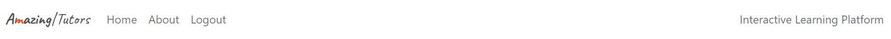

# Amazing Tutors

Amazing Tutors is a digital-powered learning platform that benefits both tutors and students by providing a flexible, engaging, resourceful, personalized, and responsive web space as a collaborative learning environment, uplifting the learner's motivation and learning experiences.

Growing from the Blog App as its foundation, Amazing Tutors implements several features to accommodate its user groups and enhance their learning experiences with this e-learning platform. A tutor, he/she can list a series of lesson materials in the use of a WYSIWYG editor (summernote) which can attach video or file links easily to create vivid and resourceful lessons for study. The implementation of a Question/Answer board namely class activities is the major plus which offers great flexibility for tutors and students to interact. Tutors can use it to list/edit tests to produce assignments,  quizzes or discussions while students can also submit discussion questions. Students can get grades and feedback quickly from tutors too, all these features form a simple yet robust collaborative learning environment.

Here's my deployed site :
[Amazing Tutors](https://amazingtutors-3f0b6cb3b188.herokuapp.com/)


## UX 

For this e-learning platform, the tutor and students are looking for a simple, neat and intuitive layout. The Tutor can claim the lesson's ownership by creating one from the front page, and he/she can edit it anytime by the WYSIWYG editor via the 'Edit Lesson' button found in the hero image area when the lesson page is loaded.  On the lesson page, all the details of the lesson are presented in front of the tutor and students, following an 'Add Note' button for them to create or update their notes. Then 'Raise Question' button is also presented next to the 'Edit lesson' for the tutor, or only 'Raise Question' is available for the student.   


The Class Activity area following the lesson and note is where collaborations and interaction activities happen. The tutor can raise three types of questions: Type 1 is the question for a test with a due date, namely an assignment question; type2 is the question for a test without a due date namely a quiz; then type 3 is the question for discussion only, and student can raise the same type 3 discussion question. Among those questions and answers, they are all colour-coded separately based on the question or answer owner's role, and the reference of each colour is presented on the tin on the page and easily distinguishable.   

 
 ### Color Scheme


### Typography

- Caveat font was used for the site lego. The font was imported from google fonts. Serif sans is the fall back font in the case of an import error

[Google Fonts](https://fonts.google.com/?query=caveat)

- The icons  used where imported from Font Awesome 

[Font Awesome](https://fontawesome.com/icons)

- The favicon used is from the following link

[Favicon.io](https://favicon.io/favicon-generator/)


### User Stories 

### Site Users

- As a user I can register an account so that I can perform authenticated activities 
- As a user I can login to my account  so that I can see lessons 
- As a user I can logout of my account  so that I keep my account secure
- As a user I can create an lesson and post videos, file links or rich format text so that I can teach students 
- As a user I can browse lessons so that I can choose which lesson to teach or learn
- As a user I can edit and or delete my lessons so that I can manage my own content on the site
- As a user I can edit and or update my notes so that I can manage my own content on the site
- As a user I can edit and or delete my questions so that I can manage my own content on the site 
- As a user I can edit and or delete my Answers so that I can manage my own content on the site
- As a user I can edit and or update the grade and feedback for the students' assignment or quiz submission 
  so that they can get the feedback  


### Site Admin
- As site admin I can access all the lessons, questions, answers, gradefeedback, about,  so that I can manage the site effectively
 


## Wireframes

To follow best practice, wireframes were developed for mobile, tablet, and desktop sizes.
I've used Balsamiq to design my site wireframes

[Balsamiq](https://balsamiq.com/wireframes) 
  


### Devices Wireframes

<details>

<summary>
Click here to see the Devices Wireframes
</summary>
 
 
     -   
 
     -
 

</details>


## Features


### Existing Features


- **Navigation Bar**

- The navigation bar is available on index and lesson_detail pages. It is fully responsive and provides links to all the areas of the website, lesson links are only presented based on whether the user is authenticated and logged in or not. Users are able to navigate on any size device with a burger menu with dropdown for small devices. users can easily click on the site logo to returnm back to the landing page.

  Desktop

  


  Mobile

  


- **Landing Page**
- The user can choose to create a lesson, or browse lessons (5 lessons max per page)


- **The Footer**

- The copyright declamation and links to facebook, linkedin, instagram and youtube

  


- **Lesson details**

- from this simplied example, can see lesson.author chienc currently login, he has put some content in lesson and note sections.  
  


- Then move on into class activities section, as chienc the lesson author has submitted a test question with a due date, platform will automatically identify and label its a 'assignemnt' and display the matching background color:cyclamen to inform its role. He answered the question with another user jeffchen. lesson author can see everyone's answer for gradefeedback here. Here jeffchen and julie have submitted their answers and chienc have graded both and left feedbacks.
  


- chienc also initiated an discussion question, answers of such type question will always be instantly displayed to all students, chienc can edit his question as he is the owner. chienc's question and answer color is distinquished from the students' color and his answer will always be promoted to the top spot as he is the lesson author.
     
- Below chienc's discussion question, student jeffchen raised another question, the color is light blue compared to chienc's ocean blue color.
  


- Here in the same lesson, we switch over to the student jeffchen's scope from the tutor chienc's. jeffchen can only raise question as he is not the lesson author aka the tutor.  


- An interesting example picture, here jeffchen has answered both chienc's test assignment questions, one has been submitted but not graded, one has been graded. now jeffchen can edit the answer not graded yet. the other answer has been graded so he no longer can edit that answer. 


- In this picture, jeffchen has answered the discussion question from the tutor and he received a grade and feedback. jeffchen also raised a discussion question and he is the question owner so he can edit both the question and answer if one provided by himself. The other student will read or answer the question only.   
  


- **Signup**

- Signup page allows the users to register and join the AmazingTutors site. 
- This allows the user to be able to create his/her lessons or become a student only. 
- User's get a message pop up letting them know they are signedup. 

  

 


- **LogIn** 

- This page allows already authenticated users to log into the site and access lessons.  
- Users get message to let then know they are login
- The logIn will then change to logout once the user is successfully loggedin.
- The user gets a prompt message if they are sure they want to log out , before getting a message they have successfully logged out if they complete the process.
- user won't be allowed to perform any activity if not login 

  

  

  


  
- **Create, Edit and Delete Lesson**

- This page is a form to create a lesson, it is only accessible to authenticated logged in users. 
- Here the user's can edit lesson in rich format text by summernote editor and publish for visibility to all users or keep it as a draft showing as faded from the index and not visible to others  
- Once saved, the user get a message to show the lesson has been created successfully 

  
  

- **Create Note**

- This page is a modal form to create a note which is situated below the lesson body, it is only accessible to authenticated logged in users. 
- Here the user's can edit note in rich format text by summernote editor, the note is only visible by individual and only can update after creation.   
- Once saved, the user will see it displayed immediately. 

  

- **Create, Edit and Delete Question**

- This page is a form to create a question, and once question is created, the user can edit or delete it.  
- Questions and answer are edited via textarea form to avoid unwanted html tag display issues.   
- Once saved, the user will see question on the acreen immediately and a message for update successfully. 

   
     

- **Create, Edit and Delete answer**

- This page is a form to create a answer, and once answer is created, the user can edit or delete it.  
- Questions and answer are edited via textarea form to avoid unwanted html tag display issues.   
- Once saved, the user will see answer on the acreen immediately and a message for update successfully. 
- in ansser create form, question and due date will display 

   
 
  **Create, Update grade_feedback**

- This page is a form to create a grade_feedback, and once grade_feedback is created, the user can update it.    
- The grade and feedback will be displayed with the answer on the acreen immediately and a message for update successfully. 
- once answer is graded, the answer owner won't be able to edit answer again. 

   


### Future Features

- **User Profiles**

- Users to have custom user profiles where they can list there accomplishments in completed lessons with their grades
- Users will have CRUD functionality and autonomy on their profiles
- Users to be able to add profile images for a more personal feel.

- **courses schedule board**

- Tutors and students have schedule board to follow the course timetable 
- also task board can highlight assignments' due date, events or class activities. 

- **AI agent assistant or tutor**

- deploy AI agent that trained up to share the tutor's loading on testing students or give students personalized feedbacks to improve learning experiences. 
- gamified challenges to motivate the students 


## Tools and Technologies used 


- [](https://git-scm.com) used for version control. (`git add`, `git commit`, `git push`)
- [](https://github.com) used for secure online code storage.
- [](https://gitpod.io) used as a cloud-based IDE for development.
- [](https://en.wikipedia.org/wiki/HTML) used for the main site content.
- [](https://en.wikipedia.org/wiki/CSS) used for the main site design and layout.
- [](https://www.python.org) used as the back-end programming language.
- [](https://www.heroku.com) used for hosting the deployed back-end site.
- [](https://getbootstrap.com) used as the front-end CSS framework for modern responsiveness and pre-built components.
- [](https://www.djangoproject.com) used as the Python framework for the site.
- [](https://www.postgresql.org) used as the relational database management.
- [](https://dbs.ci-dbs.net) used as the Postgres database from Code Institute.
- [](https://cloudinary.com) used for online static file storage.
- [](https://whitenoise.readthedocs.io) used for serving static files with Heroku.
- [](https://balsamiq.com/wireframes) used for creating wireframes.
- [](https://fontawesome.com) used for the icons.
- [](https://chat.openai.com) currently power codepilot by chatgpt4o version, used to help debug, troubleshoot, and explain things in VScode.


## Database Design 

Here is my Entity Relationship Diagrams (ERD) help to visualize database architecture before creating models.


Site used for ERD

- [Smartdraw.com](https://app.smartdraw.com/editor.aspx?credID=-72573565&depoId=63080189&flags=128)

  


## Agile Development Process


### GitHub Projects

[GitHub Projects](https://github.com/users/jeffchen1118/projects/8) 

- GitHub Projects is the Agile tool used for this project.


 

### MoSCoW Prioritization approaches 

As I am the product owner, project manager and the developer at the same time, I am actively prioritizing the product scope to justify time, resource and manpower to meet its MVP goal. The user stories and acceptance criterias were reshaped along the way on a daily basis during the project to make a very realistic approach to meet the goal while maintaining quality productivity and performance.


## Testing


### Feature-by-Feature Testing:

- Navigation:
Testested for smooth transitions between pages, links directing to the correct destinations.
- Responsive Design: 
Checked for compatibility across various devices and screen sizes.

- Lessons Display: 
lessons are properly showcased with accurate descriptions, images, and links.

- All Forms: 
Tested the form submission process, ensuring the user receives a confirmation.

### User Experience Testing:

- Usability Testing: 
The current implementation has meet the goal setup, all forms are functioning as expected, the logic meet design scope and user stories' requirements.  

- Accessibility Testing: 
All images and links have well labeled alt text for screen reader compatibility compliance.

### Compatibility Testing:

- Browser Compatibility: 
Testing applied on different browsers (Chrome, Firefox, Microsoft Edge,) to ensure consistent performance.

- Device Compatibility:

Functionality tested across various devices (desktops, laptops, tablets, and mobile phones).


 
## Code Validation


### HTML

I have used the recommended [HTML W3C Validator](https://validator.w3.org) to validate all of my HTML files.

| Directory | File | Screenshot | Notes |
| --- | --- | --- | --- |
| article | article-details.html | | |
| article | index.html |  | |
| article | new-article.html | | |
| article | reviews.html | | |
| article | delete.html | | |
| dashboard | dash.html | | |
| mainhub | main.html | | |
| newsletter | news.html | | |

### CSS

I have used the recommended [CSS Jigsaw Validator](https://jigsaw.w3.org/css-validator) to validate all of my CSS files.

| Directory | File | Screenshot | Notes |
| --- | --- | --- | --- |
| static | custom.css | | |

### Python

I have used the recommended [PEP8 CI Python Linter](https://pep8ci.herokuapp.com) to validate all of my Python files.

| Directory | File | CI URL | Screenshot | Notes |
| --- | --- | --- | --- | --- |
| article | admin.py | [PEP8 CI](https://pep8ci.herokuapp.com/https://raw.githubusercontent.com/shar-nm/lens-whisperer/main/article/admin.py) |  | |
| article | forms.py | [PEP8 CI](https://pep8ci.herokuapp.com/https://raw.githubusercontent.com/shar-nm/lens-whisperer/main/article/forms.py) | | |
| article | models.py | [PEP8 CI](https://pep8ci.herokuapp.com/https://raw.githubusercontent.com/shar-nm/lens-whisperer/main/article/models.py) | | |
| article | urls.py | [PEP8 CI](https://pep8ci.herokuapp.com/https://raw.githubusercontent.com/shar-nm/lens-whisperer/main/article/urls.py) | | |
| article | views.py | [PEP8 CI](https://pep8ci.herokuapp.com/https://raw.githubusercontent.com/shar-nm/lens-whisperer/main/article/views.py) | | |
| dashboard | admin.py | [PEP8 CI](https://pep8ci.herokuapp.com/https://raw.githubusercontent.com/shar-nm/lens-whisperer/main/dashboard/admin.py) | | not used |
| dashboard | models.py | [PEP8 CI](https://pep8ci.herokuapp.com/https://raw.githubusercontent.com/shar-nm/lens-whisperer/main/dashboard/models.py) | | not used |
| dashboard | urls.py | [PEP8 CI](https://pep8ci.herokuapp.com/https://raw.githubusercontent.com/shar-nm/lens-whisperer/main/dashboard/urls.py) | | |
| dashboard | views.py | [PEP8 CI](https://pep8ci.herokuapp.com/https://raw.githubusercontent.com/shar-nm/lens-whisperer/main/dashboard/views.py) | | |
| mainhub | admin.py | [PEP8 CI](https://pep8ci.herokuapp.com/https://raw.githubusercontent.com/shar-nm/lens-whisperer/main/mainhub/admin.py) | | not used |
| mainhub | models.py | [PEP8 CI](https://pep8ci.herokuapp.com/https://raw.githubusercontent.com/shar-nm/lens-whisperer/main/mainhub/models.py) | | not used |
| mainhub | urls.py | [PEP8 CI](https://pep8ci.herokuapp.com/https://raw.githubusercontent.com/shar-nm/lens-whisperer/main/mainhub/urls.py) | | |
| mainhub | views.py | [PEP8 CI](https://pep8ci.herokuapp.com/https://raw.githubusercontent.com/shar-nm/lens-whisperer/main/mainhub/views.py) | | |
|  | manage.py | [PEP8 CI](https://pep8ci.herokuapp.com/https://raw.githubusercontent.com/shar-nm/lens-whisperer/main/manage.py) | | |
| newsletter | admin.py | [PEP8 CI](https://pep8ci.herokuapp.com/https://raw.githubusercontent.com/shar-nm/lens-whisperer/main/newsletter/admin.py) | | not used |
| newsletter | models.py | [PEP8 CI](https://pep8ci.herokuapp.com/https://raw.githubusercontent.com/shar-nm/lens-whisperer/main/newsletter/models.py) | | not used |
| newsletter | urls.py | [PEP8 CI](https://pep8ci.herokuapp.com/https://raw.githubusercontent.com/shar-nm/lens-whisperer/main/newsletter/urls.py) | | |
| newsletter | views.py | [PEP8 CI](https://pep8ci.herokuapp.com/https://raw.githubusercontent.com/shar-nm/lens-whisperer/main/newsletter/views.py) | | |
| photography | settings.py | [PEP8 CI](https://pep8ci.herokuapp.com/https://raw.githubusercontent.com/shar-nm/lens-whisperer/main/photography/settings.py) | | |
| photography | urls.py | [PEP8 CI](https://pep8ci.herokuapp.com/https://raw.githubusercontent.com/shar-nm/lens-whisperer/main/photography/urls.py) | | |

## Browser Compatibility

I've tested my deployed project on multiple browsers to check for compatibility issues.

| Browser |  |  |  |  | Notes |
| --- | --- | --- | --- | --- | --- |
| Chrome |  |  |  | Works as expected |
| Firefox |  |  |  | Works as expected |
| Safari |  |  |  | Works as expected |

## Responsiveness

I've tested my deployed project on multiple devices to check for responsiveness issues.

|  |  |  |  | | Notes |
| --- | --- | --- | --- | --- | --- |
| Mobile (DevTools) |  |  |  | Works as expected |
| Tablet (DevTools) |  |  |  | Works as expected |
| Desktop |  |  |  | Works as expected |

## Lighthouse Audit


I've tested my deployed project using the Lighthouse Audit tool to check for any major issues.

| Page | Mobile | Desktop | Notes |
| --- | --- | --- | --- |
| |  |  | Some minor warnings |

## Defensive Programming

| Page | User Action | Expected Result | Pass/Fail | Comments |
| --- | --- | --- | --- | --- |
| Home | | | | |
| | Click on Logo | Redirection to Home page | Pass | |
| | Click on Home link in navbar | Redirection to Home page | Pass | |
| Gallery | | | | |
| | Click on Gallery link in navbar | Redirection to Gallery page | Pass | |
| | Load gallery images | All images load as expected | Pass | |
| Contact | | | | |
| | Click on Contact link in navbar | Redirection to Contact page | Pass | |
| | Enter first/last name | Field will accept freeform text | Pass | |
| | Enter valid email address | Field will only accept email address format | Pass | |
| | Enter message in textarea | Field will accept freeform text | Pass | |
| | Click the Submit button | Redirects user to form-dump | Pass | User must click 'Back' button to return |
| Sign Up | | | | |
| | Click on Sign Up button | Redirection to Sign Up page | Pass | |
| | Enter valid email address | Field will only accept email address format | Pass | |
| | Enter valid password (twice) | Field will only accept password format | Pass | |
| | Click on Sign Up button | Asks user to confirm email page | Pass | Email sent to user |
| | Confirm email | Redirects user to blank Sign In page | Pass | |
| Log In | | | | |
| | Click on the Login link | Redirection to Login page | Pass | |
| | Enter valid email address | Field will only accept email address format | Pass | |
| | Enter valid password | Field will only accept password format | Pass | |
| | Click Login button | Redirects user to home page | Pass | |
| Log Out | | | | |
| | Click Logout button | Redirects user to logout page | Pass | Confirms logout first |
| | Click Confirm Logout button | Redirects user to home page | Pass | |
| Profile | | | | |
| | Click on Profile button | User will be redirected to the Profile page | Pass | |
| | Click on the Edit button | User will be redirected to the edit profile page | Pass | |
| | Click on the My Orders link | User will be redirected to the My Orders page | Pass | |
| | Brute forcing the URL to get to another user's profile | User should be given an error | Pass | Redirects user back to own profile |
| repeat for all remaining pages | x | x | x | x |

## User Story Testing

| User Story | Screenshot |
| --- | --- |
| As a new site user, I would like to view the articles, so that I can read and learn. |  |
| As a new site user, I would like to review a peer article, so that I can make a contribution to the site . |  |
| As a new site user, I would like to create an article, so that I can have feedback from other users. |  |
| As a returning site user, I would like to edit and delete my articles, so that I can manage my own content. |  |
| As a new site user, I would like to signup to the site, so that I can read articles and post my own. |  |
| As a returning site user, I would like to log in, so that I can see my posted articles. |  |
| As a site user, I should be able to logout, so that I can keep my account secure. |  |
| As a site administrator, I should be able to access all articles, so that I can review and manage site. |  |
| As a site administrator, I should be able to share news in the photography industry, so that I can keep users well informed. |  |


## Deployment

The live deployed application can be found deployed on :

[Heroku](https://lens-whisperer-1fde92b99730.herokuapp.com).

### PostgreSQL Database

This project uses a [Code Institute PostgreSQL Database](https://dbs.ci-dbs.net).

To obtain my own Postgres Database from Code Institute, I followed these steps:

- Signed-in to the CI LMS using my email address.
- An email was sent to me with my new Postgres Database.

> [!CAUTION]  
> - PostgreSQL databases by Code Institute are only available to CI Students.
> - You must acquire your own PostgreSQL database through some other method
> if you plan to clone/fork this repository.
> - Code Institute students are allowed a maximum of 8 databases.
> - Databases are subject to deletion after 18 months.


### Cloudinary API

This project uses the [Cloudinary API](https://cloudinary.com) to store media assets online, due to the fact that Heroku doesn't persist this type of data.

To obtain your own Cloudinary API key, create an account and log in.

- For *Primary interest*, you can choose *Programmable Media for image and video API*.
- Optional: *edit your assigned cloud name to something more memorable*.
- On your Cloudinary Dashboard, you can copy your **API Environment Variable**.
- Be sure to remove the `CLOUDINARY_URL=` as part of the API **value**; this is the **key**.

### Heroku Deployment

This project uses [Heroku](https://www.heroku.com), a platform as a service (PaaS) that enables developers to build, run, and operate applications entirely in the cloud.

Deployment steps are as follows, after account setup:

- Select **New** in the top-right corner of your Heroku Dashboard, and select **Create new app** from the dropdown menu.
- Your app name must be unique, and then choose a region closest to you (EU or USA), and finally, select **Create App**.
- From the new app **Settings**, click **Reveal Config Vars**, and set your environment variables.

> [!IMPORTANT]  
> This is a sample only; you would replace the values with your own if cloning/forking my repository.

| Key | Value |
| --- | --- |
| `CLOUDINARY_NAME` | user's own value |
| `CLOUDINARY_API` | user's own value |
| `CLOUDINARY_SECRET` | user's own value |
| `DB_URL` | user's own value |
| `DISABLE_COLLECTSTATIC` | 1 (*this is temporary, and can be removed for the final deployment*) |
| `SECRET_KEY` | user's own value |

Heroku needs three additional files in order to deploy properly.

- requirements.txt
- Procfile
- runtime.txt

You can install this project's **requirements** (where applicable) using:

- `pip3 install -r requirements.txt`

If you have your own packages that have been installed, then the requirements file needs updated using:

- `pip3 freeze --local > requirements.txt`

The **Procfile** can be created with the following command:

- `echo web: gunicorn app_name.wsgi > Procfile`
- *replace **app_name** with the name of your primary Django app name; the folder where settings.py is located*

The **runtime.txt** file needs to know which Python version you're using:
1. type: `python3 --version` in the terminal.
2. in the **runtime.txt** file, add your Python version:
	- `python-3.9.18`

For Heroku deployment, follow these steps to connect your own GitHub repository to the newly created app:

Either:

- Select **Automatic Deployment** from the Heroku app.

Or:

- In the Terminal/CLI, connect to Heroku using this command: `heroku login -i`
- Set the remote for Heroku: `heroku git:remote -a app_name` (replace *app_name* with your app name)
- After performing the standard Git `add`, `commit`, and `push` to GitHub, you can now type:
	- `git push heroku main`

The project should now be connected and deployed to Heroku!


### Local Deployment

This project can be cloned or forked in order to make a local copy on your own system.

For either method, you will need to install any applicable packages found within the *requirements.txt* file.

- `pip3 install -r requirements.txt`.

You will need to create a new file called `env.py` at the root-level,
and include the same environment variables listed above from the Heroku deployment steps.

> [!IMPORTANT]  
> This is a sample only; you would replace the values with your own if cloning/forking my repository.

Sample `env.py` file:

```python
import os

os.environ.setdefault("CLOUDINARY_NAME", "user's own value")
os.environ.setdefault("CLOUDINARY_API", "user's own value")
os.environ.setdefault("CLOUDINARY_SECRET", "user's own value")
os.environ.setdefault("DB_URL", "user's own value")
os.environ.setdefault("SECRET_KEY", "user's own value")

# local environment only (do not include these in production/deployment!)
os.environ.setdefault("DEBUG", "True")
```

Once the project is cloned or forked, in order to run it locally, you'll need to follow these steps:

- Start the Django app: `python3 manage.py runserver`
- Stop the app once it's loaded: `CTRL+C` or `⌘+C` (Mac)
- Make any necessary migrations: `python3 manage.py makemigrations`
- Migrate the data to the database: `python3 manage.py migrate`
- Create a superuser: `python3 manage.py createsuperuser`
- Load fixtures (if applicable): `python3 manage.py loaddata file-name.json` (repeat for each file)
- Everything should be ready now, so run the Django app again: `python3 manage.py runserver`


#### Cloning

You can clone the repository by following these steps:

1. Go to the [GitHub repository](https://github.com/shar-nm/lens-whisperer) 
2. Locate the Code button above the list of files and click it 
3. Select if you prefer to clone using HTTPS, SSH, or GitHub CLI and click the copy button to copy the URL to your clipboard
4. Open Git Bash or Terminal
5. Change the current working directory to the one where you want the cloned directory
6. In your IDE Terminal, type the following command to clone my repository:
	- `git clone https://github.com/shar-nm/lens-whisperer.git`
7. Press Enter to create your local clone.

Alternatively, if using Gitpod, you can click below to create your own workspace using this repository.

[](https://gitpod.io/#https://github.com/shar-nm/lens-whisperer)

Please note that in order to directly open the project in Gitpod, you need to have the browser extension installed.
A tutorial on how to do that can be found [here](https://www.gitpod.io/docs/configure/user-settings/browser-extension).


#### Forking

By forking the GitHub Repository, we make a copy of the original repository on our GitHub account to view and/or make changes without affecting the original owner's repository.
You can fork this repository by using the following steps:

1. Log in to GitHub and locate the [GitHub Repository](https://github.com/shar-nm/lens-whisperer)
2. At the top of the Repository (not top of page) just above the "Settings" Button on the menu, locate the "Fork" Button.
3. Once clicked, you should now have a copy of the original repository in your own GitHub account!


### Local VS Deployment

-  Local development environment has different configuration settings compared to the live deployment environment on Heroku. This includes database configurations, static file serving settings, debug mode, logging configurations
- Configuration settings and sensitive information such as database credentials, API keys, and secret keys are  stored as environment variables in production environments in Heroku. In  local env settings files and environment variables are stored locally during development.
- Heroku serves static files (CSS, JavaScript, images) using WhiteNoise or by integrating with a content delivery network (CDN). In local environment, Django's development server handles static files differently.
- Heroku provides security measures such as HTTPS support, automated security updates, and platform-level security features. These are not be present or configured in local development environment.


## Credits

- [CI Blog](https://github.com/Code-Institute-Solutions/blog.git)
- [SteinOveHelset](https://github.com/SteinOveHelset/puddle.git)
- [Codemy](https://www.youtube.com/channel/UCFB0dxMudkws1q8w5NJEAmw/about)


### Content

 - [ChatGPT 3.5](https://chat.openai.com/?model=text-davinci-002-render-sha)
 - [Adobe Creative Cloud](https://www.adobe.com/uk/creativecloud/photography/discover.html)

| Source | Location | Notes |
| --- | --- | --- |
| [Markdown Builder](https://tim.2bn.dev/markdown-builder) | README and TESTING | tool to help generate the Markdown files |
| [Chris Beams](https://chris.beams.io/posts/git-commit) | version control | "How to Write a Git Commit Message" |
| [W3Schools](https://www.w3schools.com/howto/howto_js_topnav_responsive.asp) | entire site | responsive HTML/CSS/JS navbar |
| [StackOverflow](https://stackoverflow.com/questions/78216228/how-can-i-authenticate-a-user-based-on-correct-incorrect-credentials-but-ignore) | troubleshooting | Authentication in django |
| [YouTube](https://www.youtube.com/watch?v=ZxMB6Njs3ck&list=WL&index=19&t=7646s) | CRUD | tutorial for adding, viewing, updating and deleting items with django the Python|
| [strftime](https://strftime.org) | CRUD functionality | helpful tool to format date/time from string |
| [WhiteNoise](http://whitenoise.evans.io) | entire site | hosting static files on Heroku temporarily |
| [Bootstrap 5.3](https://getbootstrap.com/docs/5.3/getting-started/) | entire site | responsivenes and CSS |

### Media


| Source | Location | Type | Notes |
| --- | --- | --- | --- |
[Pixabay](https://pixabay.com) | articles page | image | group of photos for articles |
[Freepix](https://www.freepik.com/) | entire site | images | photos used thorough out the site |
[Freepix,lookstudio](https://www.freepik.com/free-photo/appealing-french-woman-sunglasses-laughing-fashionable-curly-ginger-girl-fooling-around-white-wall_12018194.htm#fromView=search&page=1&position=49&uuid=bbc66285-de26-4c6c-9283-d191d004ac47) | newsletter | image | image used in the newsletter |
[Freepix,rawpixel.com](https://www.freepik.com/free-photo/digital-lens-isolated-white-background_3276335.htm#fromView=search&page=1&position=31&uuid=387f9284-73f9-4cd5-86aa-8ba203154a39")  | newsletter | image | image used in the newsletter |


### Acknowledgements

I would like to thank my Code Institute mentor, [Tim Nelson](https://github.com/TravelTimN) for his support throughout the development of this project.
- I would like to thank the [Code Institute](https://codeinstitute.net) tutor team for their assistance with troubleshooting and debugging some project issues.
- I would like to thank the [Code Institute Gwent-Bootcamp](https://code-institute-room.slack.com) for the moral support; it kept me going during periods of self doubt and imposter syndrome.
- I would like to thank my partner (Michael), for believing in me, and allowing me to make this transition into software development.
- I would like to thank my daughter (Nicole), for supporting me by doing all the user testing and proof-reading therefore supporting me through this career change towards becoming a software developer.


